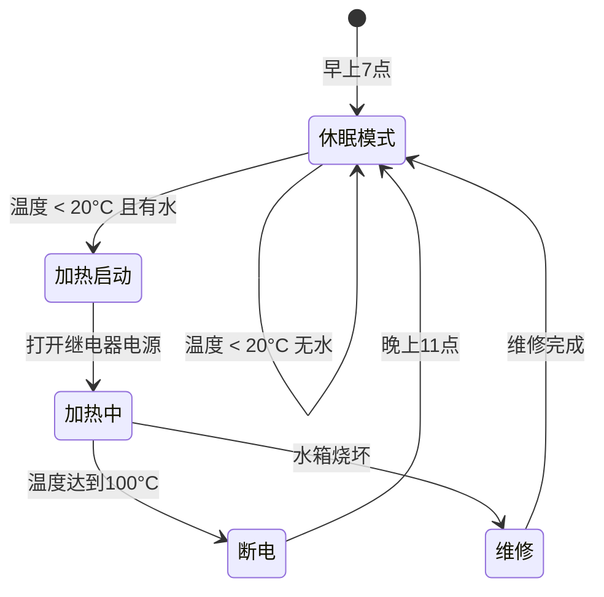
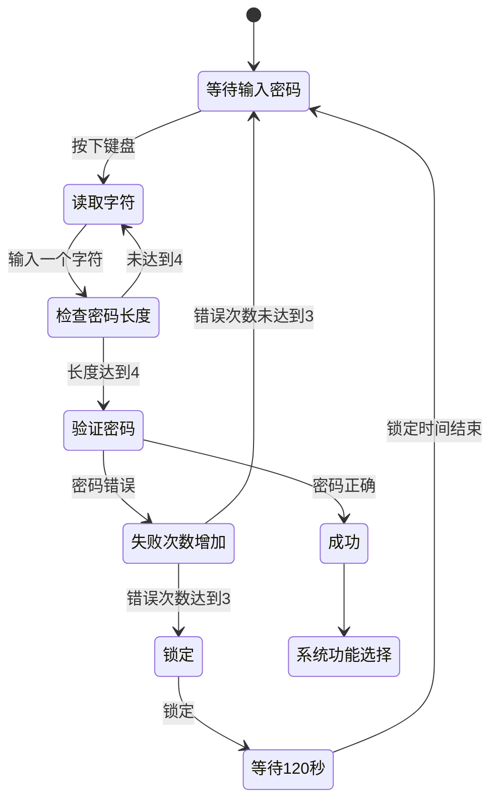
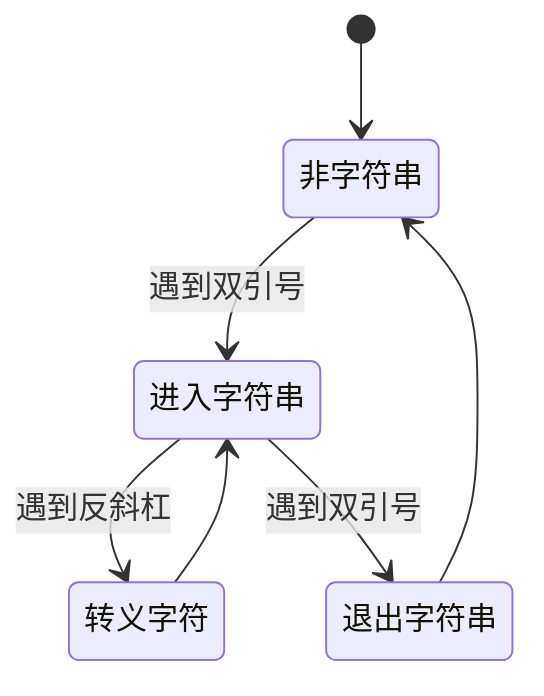

### B1

```mermaid
stateDiagram
    [*] --> 休眠模式 : 早上7点
    休眠模式 --> 加热启动 : 温度 < 20°C 且有水
    休眠模式 --> 休眠模式 : 温度 < 20°C 无水
    加热启动 --> 加热中 : 打开继电器电源
    加热中 --> 断电 : 温度达到100°C
    加热中 --> 维修 : 水箱烧坏
    断电 --> 休眠模式 : 晚上11点
    维修 --> 休眠模式 : 维修完成
```
### B2

```mermaid
stateDiagram
    [*] --> 等待输入密码
    等待输入密码 --> 读取字符 : 按下键盘
    读取字符 --> 检查密码长度 : 输入一个字符
    检查密码长度 --> 验证密码 : 长度达到4
    检查密码长度 --> 读取字符 : 未达到4
    验证密码 --> 成功 : 密码正确
    验证密码 --> 失败次数增加 : 密码错误
    失败次数增加 --> 锁定 : 错误次数达到3
    失败次数增加 --> 等待输入密码 : 错误次数未达到3
    锁定 --> 等待120秒 : 锁定
    等待120秒 --> 等待输入密码 : 锁定时间结束
    成功 --> 系统功能选择
```
### B3

```mermaid
stateDiagram
    [*] --> 非字符串
    非字符串 --> 进入字符串 : 遇到双引号
    进入字符串 --> 转义字符 : 遇到反斜杠
    进入字符串 --> 退出字符串 : 遇到双引号
    转义字符 --> 进入字符串
    退出字符串 --> 非字符串
```